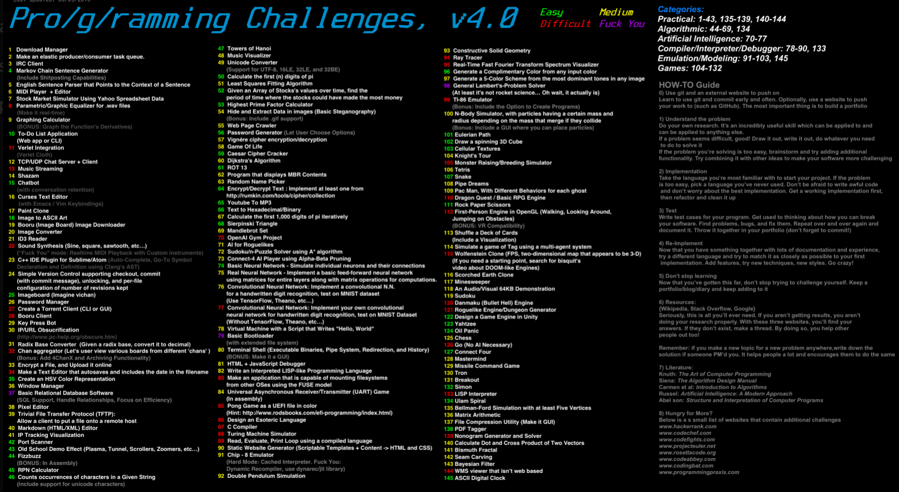

# Project Ideas
## Programming challenges

## An extended list of project ideas:
* [40 Side Project Ideas for Software Engineers](https://www.codementor.io/npostolovski/40-side-project-ideas-for-software-engineers-g8xckyxef)
* [App Ideas Collection](http://www.ideaswatch.com/startup-ideas/app)
* [Make your own...](https://github.com/danistefanovic/build-your-own-x)
* [Practical Projects](https://github.com/karan/Projects)
* [1000+ Beginner Programming Projects](https://www.reddit.com/r/learnprogramming/comments/2a9ygh/1000_beginner_programming_projects_xpost/)
* [Awesome for Beginners](https://github.com/MunGell/awesome-for-beginners)
* [Project Based Learning](https://github.com/tuvtran/project-based-learning)
* [Rosetta Code](http://rosettacode.org/wiki/Category:Programming_Tasks)
* [Epic List Of Side Project Ideas For Programmers](https://livingliferichly.com/epic-list-of-side-project-ideas-for-programmers)
* [5 project ideas](https://medium.com/@JohanneA/5-project-ideas-for-programmers-who-dont-know-what-to-work-on-next-51fdb191cbde)
* [6 project ideas to help you write creative code](https://blog.kadenze.com/creative-technology/6-projects-to-help-you-learn-creative-code/)
